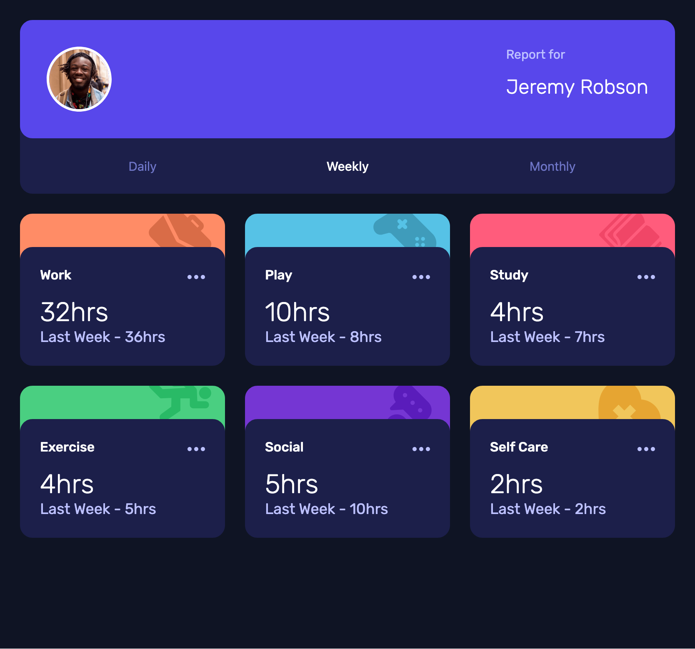

# Frontend Mentor - Time tracking dashboard solution

This is a solution to the [Time tracking dashboard challenge on Frontend Mentor](https://www.frontendmentor.io/challenges/time-tracking-dashboard-UIQ7167Jw). Frontend Mentor challenges help you improve your coding skills by building realistic projects. 

## Table of contents

- [Overview](#overview)
  - [The challenge](#the-challenge)
  - [Screenshot](#screenshot)
  - [Links](#links)
- [My process](#my-process)
  - [Built with](#built-with)
  - [What I learned](#what-i-learned)
  - [Continued development](#continued-development)
  - [Useful resources](#useful-resources)
- [Author](#author)

## Overview

### The challenge

Users should be able to:

- View the optimal layout for the site depending on their device's screen size
- See hover states for all interactive elements on the page
- Switch between viewing Daily, Weekly, and Monthly stats

### Screenshot

### Links

- Solution URL: [Add solution URL here](https://your-solution-url.com)
- Live Site URL: [Add live site URL here](https://your-live-site-url.com)

## My process

### Built with

- Semantic HTML5 markup
- CSS custom properties
- CSS Grid
- Mobile-first workflow
- JavaScript

### What I learned

While working on this project, I gained a deeper understanding of responsive design using CSS Grid and custom properties. I also learned how to fetch and dynamically render data from a JSON file using JavaScript and async/await.

### Continued development

I’d like to continue improving how I use JavaScript to structure and render data more efficiently. I also plan to deepen my understanding of container queries and grid layout strategies for responsive designs. 

### Useful resources

- [Josh W. Comeau's Interactive Guide to CSS Grid](https://www.joshwcomeau.com/css/interactive-guide-to-grid/) — This interactive guide made it easier to understand how CSS Grid works. It helped me visualize layout behavior and confidently apply the right grid properties in my project.

- [Asynchronous JavaScript](https://youtu.be/OFpqvaJ3QYg?si=isNNQlJ4VEMHDu5u) — This video helped me better understand how `async/await` works and how to use it to fetch and display dynamic data.

## Author

- Frontend Mentor - [@@rainbowsurfer137](https://www.frontendmentor.io/profile/rainbowsurfer137)

